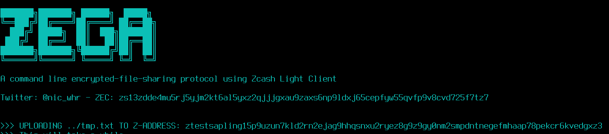

# ZEGA - A command line encrypted-file-sharing CLI using ZecWallet light client.

Yes, you don't need a Zcash full-node



## How it works:

### Shielded Transactions

In Zcash, a 500 bytes memo field is available for shielded transactions. This allows the sender to include relevant information to the receiver, completely encrypted.
A z2z transaction appears on the public blockchain, so it is known to have occured and that the fees were paid. But the addresses, transaction amount and the memo field are all encrypted and not publicly visible. The z-address owner has the option to disclose all incoming transactions and the memo field, with the related viewing key.
Zega exploits this providing encrypted-file upload and download functions.

### Light client

ZEGA relies to a `zecwallet-cli` by generating a local zcash wallet that works as light node in order to interact with the zcash blockchain.

### Upload

ZEGA splits the file into parts of 500 bytes, for each it sends a shielded transaction appending the part in the memo field. ZEGA generate a new z-address for each file upload but you can provide an external z-address.

### Download

In order to download the file you must provide the viewing key to ZEGA or the z-address for generated locally/already imported viewing key. 

## Installation:

Make sure you have the latest version of `zecwallet-cli` in your PATH. You can download the latest binary release from [zecwallet-cli repository](https://github.com/adityapk00/zecwallet-light-cli),

### Setup virtual environment

```bash
$ python3 -m venv venv
$ source venv/bin/activate
(venv) $ pip install -r requirements.txt      
```
## Usage

```bash
$ python3 zega.py -h       
usage: zega.py [-h] {upload,download} ...

ZEGA - A command line file-sharing protocol using ZecWallet light client

positional arguments:
  {upload,download}

optional arguments:
  -h, --help         show this help message and exit
```

## Upload a file
```bash
$ python3 zega.py upload  -h
usage: zega.py upload [-h] [--verbose] [--zaddr ZADDR] [--testnet]
                      [--server SERVER] --file FILE --description DESCRIPTION

optional arguments:
  -h, --help            show this help message and exit
  --verbose, -v         Verbose mode
  --zaddr ZADDR, -z ZADDR
                        Provide a z-address
  --testnet, -t         Use Zcash Testnet (Server: testnet.lightwalletd.com)
  --server SERVER, -s SERVER
                        Connect to custom lightwalletd server
  --file FILE, -f FILE  Input file
  --description DESCRIPTION, -d DESCRIPTION
                        File description


```

## Download a file:

```bash
$ python3 zega.py download  -h
usage: zega.py download [-h] [--verbose] [--zaddr ZADDR] [--testnet]
                        [--server SERVER] [--viewing-key VIEWING_KEY]
                        [--rescan-height RESCAN_HEIGHT]
                        [--destination DESTINATION]

optional arguments:
  -h, --help            show this help message and exit
  --verbose, -v         Verbose mode
  --zaddr ZADDR, -z ZADDR
                        Provide a z-address
  --testnet, -t         Use Zcash Testnet (Server: testnet.lightwalletd.com)
  --server SERVER, -s SERVER
                        Connect to custom lightwalletd server
  --viewing-key VIEWING_KEY, -k VIEWING_KEY
                        Download the specified viewing-key related file
  --rescan-height RESCAN_HEIGHT, -r RESCAN_HEIGHT
                        Rescan from block height (Default: 1500000)
  --destination DESTINATION, -o DESTINATION
                        Save file to the specified destination folder
                        (Default: ./)

```

### Examples
```bash
#Upload ../tmp.txt to new generated z-addr and return the viewing-key
$ python3 zega.py upload --file ../tmp.txt --description "testfile" --testnet --verbose

#Upload ../tmp.txt to to specific z-addr WARNING: MAKE SURE YOU HAVE THE VIEWING-KEY
$ python3 zega.py upload --file ../tmp.txt --description "testfile" --zaddr ztestsapling1xsvunsm5lkae9lrxqvdupezdzyt3s9s2jv0vye8w09675d8ywtl3p5xxzrym7nv0rcyt6c0ext2 --testnet --verbose


#Download the file related to the viewing-key in the current directory
$ python3 zega.py download --viewing-key zxviewtestsapling1q0hru2ccqqqqpq9adx98k3n7v4t4xwnd53nvz2dums474zyjsxlu5xdk7lszv9k49jwy5eq67m0cpy06j50qkc2zyzhjwnmz9ryguhu3jvp4sw3l756gg408ca5vrgr7peg67sm7zxvqh7m7z7d3vg5jjmzmn8nk0x3xeucdkwxp3q2jykarsfaw7luae8a7jgrduekv66qndru07zp07newthxqchs74z6rv7q48q7xwkr85zmceg8k4y7xp9shhc0cgmehm3akctqs3z7pn  --testnet --verbose

#Download the file related to the z-address (if yours) in the current directory
$ python3 zega.py download --zaddr ztestsapling1xsvunsm5lkae9lrxqvdupezdzyt3s9s2jv0vye8w09675d8ywtl3p5xxzrym7nv0rcyt6c0ext2 --testnet --verbose

```
### Disclaimer
Zega it's a very unstable experiment:
* USE IT ON TESTNET --testnet
* Feel free to support and contribute to the project


## Testnet Faucet

https://faucet.zecpages.com

Faucet code: https://github.com/michaelharms6010/zcash-faucet

## Greetings

This project is a funny extended version of [michaelharms6010/fullnode-zupload](https://github.com/michaelharms6010/fullnode-zupload) using [adityapk00/zecwallet-light-cli](https://github.com/adityapk00/zecwallet-light-cli)

Thanks @adityapk00 and @michaelharms6010 for your awesome work!

## Tip Jar

ZEC: zs13zdde4mu5rj5yjm2kt6al5yxz2qjjjgxau9zaxs6np9ldxj65cepfyw55qvfp9v8cvd725f7tz7
